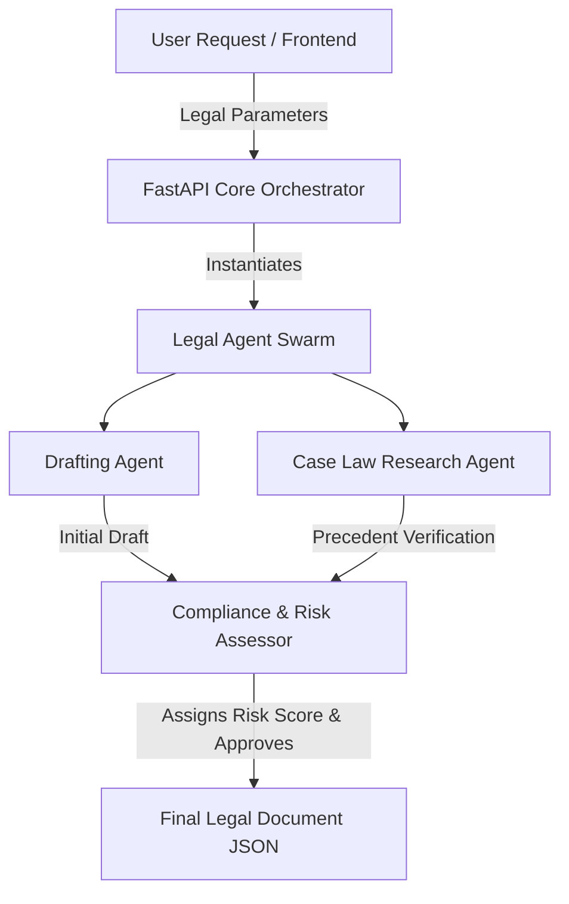

<div align="center">
  <h1>⚖️ Automated Law Firm</h1>
  <p><b>Local Autonomous Agents for Legal Drafting & Case Law Research</b></p>

  
  
  
  
  
</div>

<br>

---

## ⚡ Executive Summary

Lawyers charge upwards of $500/hr for boilerplate contract generation and basic legal research. **Automated Law Firm** is an open-source swarm of autonomous AI agents designed to completely replace traditional junior legal counsel.

By running this entire architecture locally on edge hardware, the system solves the biggest barrier to AI integration in the legal sector: **Absolute Privacy.** Your proprietary business contracts, sensitive M&A parameters, and employee details never touch a third-party server or get logged by external corporate LLMs.

## 🏗️ Agent Swarm Architecture

The backend is powered by a blazing-fast **FastAPI** orchestrator that delegates complex legal tasks to a specialized swarm of "Partner" agents, ensuring high accuracy and legal compliance.



## ✨ Core Capabilities

*   **Instant Contract Generation:** Generate highly customized NDAs, SaaS Agreements, Employment Contracts, and Terms of Service locally in seconds.
*   **Zero Privacy Leaks:** Completely offline capability ensures absolute attorney-client privilege is never compromised.
*   **Algorithmic Risk Scoring:** Every generated document is passed through an internal compliance agent that assigns a mathematical risk score based on jurisdictional strictness.
*   **Strict Type Validation:** Built on Pydantic, ensuring that critical legal entities (parties, jurisdictions) are strictly typed and parsed.

---

## 📂 Project Structure

```text
automated-law-firm/
├── src/
│   ├── api/
│   │   └── router.py       # FastAPI HTTP endpoints
│   ├── core/
│   │   └── config.py       # Compliance strictness & Env Loaders
│   ├── models/
│   │   └── legal.py        # Pydantic schemas (ContractParams, DraftOutput)
│   ├── services/
│   │   └── agent.py        # Core autonomous legal swarm logic
│   └── main.py             # ASGI Application Entrypoint
├── tests/
│   └── test_main.py        # Pytest suites ensuring contract integrity
├── .github/workflows/
│   └── ci.yml              # Automated CI/CD pipelines
├── Makefile                # Quickstart commands
└── requirements.txt        # Strict dependency locking
```

---

## 🚀 Quick Start Guide

### Prerequisites
*   Python 3.10 or higher
*   (Optional) An active `.env` file to configure compliance strictness.

### 1. Installation

Clone the repository and install dependencies instantly using the built-in Makefile:
```bash
git clone https://github.com/lakshanmuruganandam/automated-law-firm.git
cd automated-law-firm
make install
```

### 2. Configuration (Optional)

Create a `.env` file in the root directory to tune the swarm's behavior:
```ini
ENVIRONMENT=production
COMPLIANCE_STRICTNESS=0.99
```

### 3. Boot the Firm

```bash
make run
```
The API will be available at `http://127.0.0.1:8000`. You can interact with the auto-generated Swagger UI documentation at `http://127.0.0.1:8000/docs`.

### 4. Run the Test Suite

```bash
make test
```

---

## 🗺️ Future Roadmap

- [ ] **Phase 2:** PDF / DOCX compiler integration for auto-exporting formatted legal documents.
- [ ] **Phase 3:** RAG (Retrieval-Augmented Generation) pipeline for injecting local PDF state laws into the agent's context window.
- [ ] **Phase 4:** Multi-agent negotiation engine (allowing two local swarms to "argue" and negotiate a contract's middle ground).

## 🤝 Contributing

We welcome contributions from legal engineers and AI researchers! Please follow our strict CI guidelines:
1. Fork the repository.
2. Create your feature branch (`git checkout -b feature/NewLegalModule`).
3. Ensure all tests pass (`make test`).
4. Open a Pull Request.

## 📝 License

Distributed under the MIT License. See `LICENSE` for more information.
