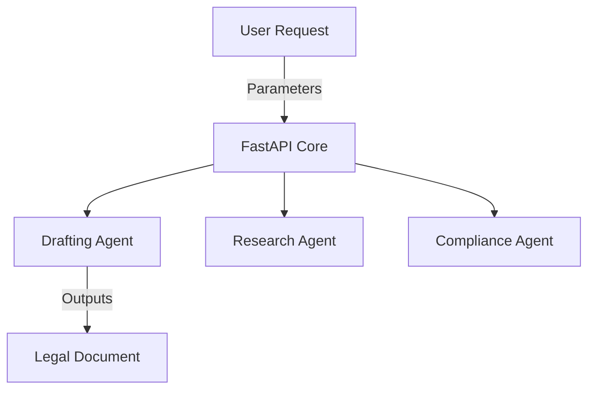

<div align="center">
  <h1>⚖️ Automated Law Firm</h1>
  <p><b>Local Autonomous Agents for Legal Drafting & Case Law Research</b></p>

  
  
  
  
  
</div>

<br>

---

## ⚡ Executive Summary

Lawyers charge upwards of $500/hr for boilerplate contract generation and basic research. **Automated Law Firm** is an open-source swarm of autonomous AI agents designed to replace traditional junior counsel.

By running this entire architecture on your local edge hardware, it solves the biggest barrier to AI in the legal sector: **Absolute Privacy.** Your proprietary business contracts and sensitive legal parameters never touch a third-party server.

## 🏗️ Architecture Overview

The backend is powered by a blazing-fast **FastAPI** orchestrator that delegates tasks to specialized "Partner" agents.



## ✨ Core Capabilities

*   **Instant Contract Generation:** Generate highly customized NDAs, SaaS Agreements, and Employment Contracts locally in seconds.
*   **Zero Privacy Leaks:** Completely offline capability ensures attorney-client privilege is never compromised by cloud LLM data logging.
*   **Production-Ready:** Engineered with Python 3.10+, complete with CI/CD pipelines and a comprehensive test suite.

---

## 🚀 Quick Start Guide

### 1. Installation

Clone the repository and install dependencies instantly using the built-in Makefile:
```bash
git clone https://github.com/lakshanmuruganandam/automated-law-firm.git
cd automated-law-firm
make install
```

### 2. Boot the Firm

```bash
make run
```
The API will be available at `http://127.0.0.1:8000/docs`.

### 3. Run the Test Suite

```bash
make test
```

## 📝 License

Distributed under the MIT License. See `LICENSE` for more information.
